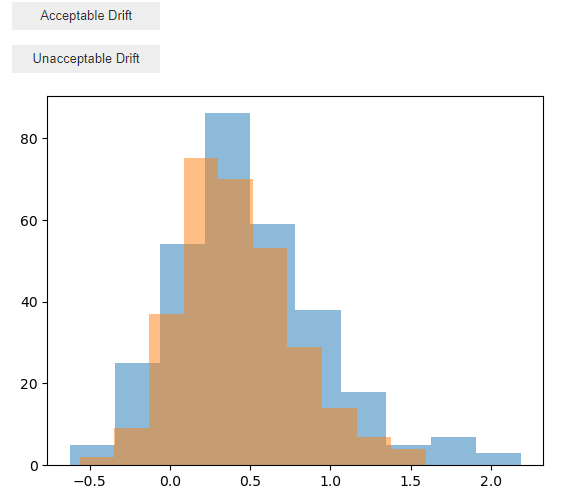
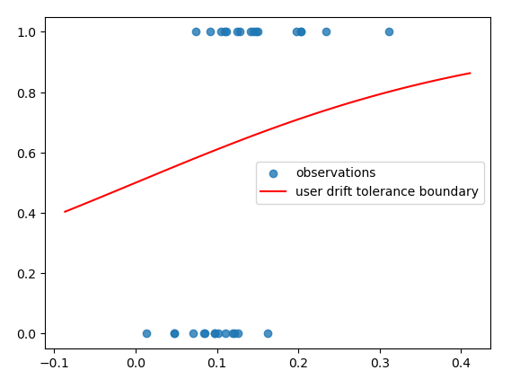

# Distribution Drift Tolerance

An interactive notebook to explore a user's personal preference around what constitutes acceptable distribution drift by having them compare a series of two distributions and having them label the second as being either having acceptable or unacceptable drift.

The interface for labeling looks as follows:

After the labels are collected along with associated PSI scores, a basyesian logistic model is fit on the relationship to try and establish the user's intuition on what types of distributions are acceptable or not. When a user has a noisy preference, with overlapping labels in the same PSI ranges, the relationship may be less clear cut.

An example of evaluations and plotted logistic relationship from PSI to acceptable risk or not is shown below:

